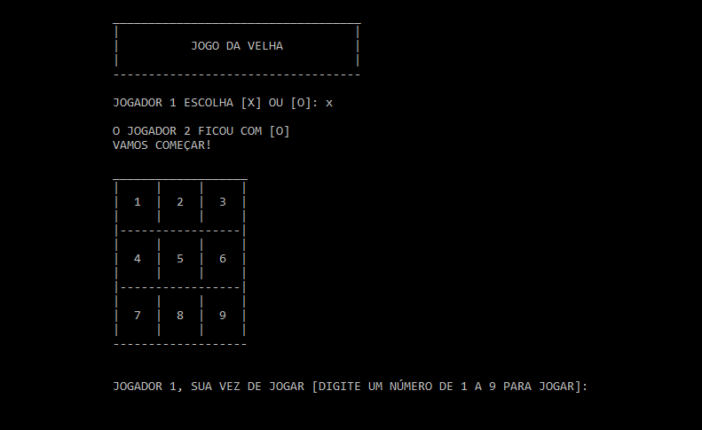
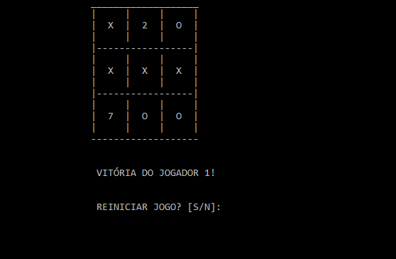

<h1 align="center">
  Jogo da velha
</h1>

 

  

 

## **Sobre o projeto**

#### Projeto prático para a disciplina de Programação estruturada e algoritmos II.

Jogo da velha desenvolvido para aprimorar os conhecimentos em ponteiros.

 

## **Demonstração**

O jogo começa pedindo para o primeiro jogador escolher 'X' ou 'O'. Com a escolha feita, o jogo se inicia. O jogador que completar uma linha, coluna ou diagoal primeiro, vence o jogo

 

  

 

## **Tecnologia utilizada**

